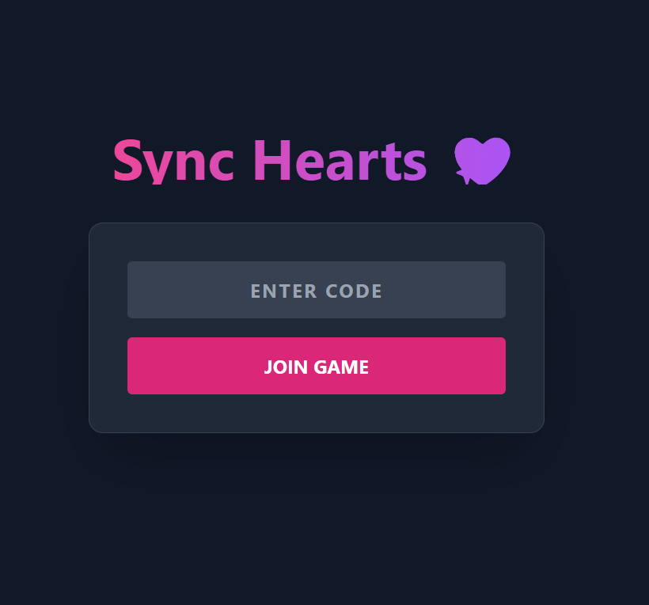
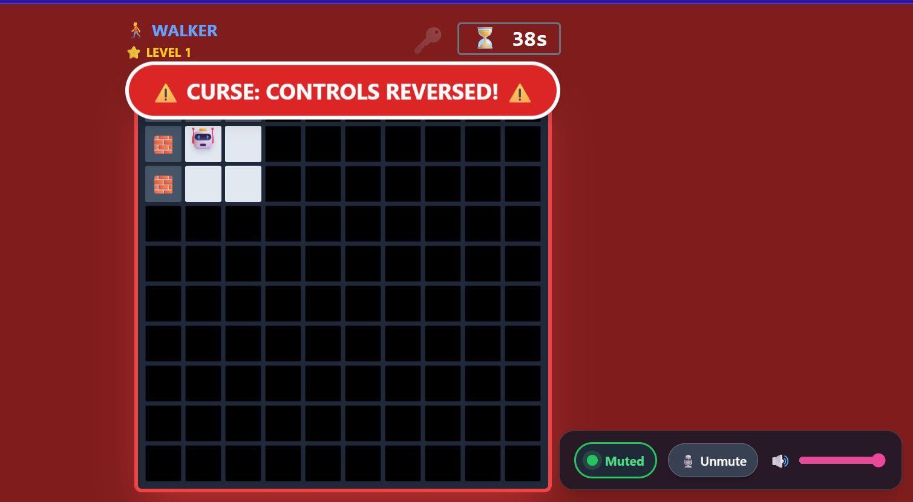
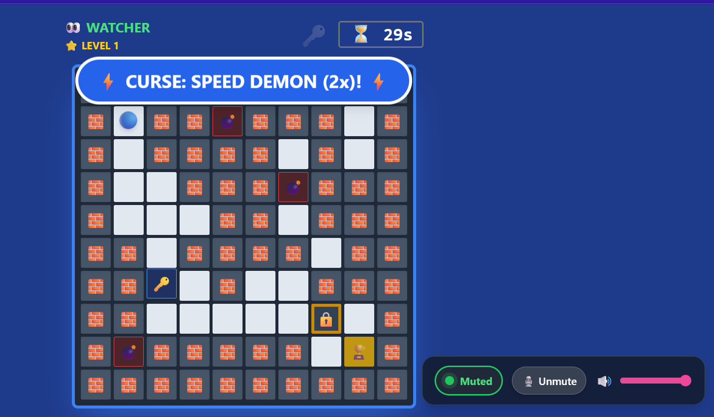

# 💖 Sync Hearts: A Real-Time Cooperative Game


**Sync Hearts** is a real-time, asymmetric cooperative web game designed to test communication and trust between two players. Built from scratch using **WebSockets** and **Procedural Generation algorithms**.

🔗 **[PLAY THE LIVE DEMO HERE](https://sync-hearts-mevg.vercel.app)**

---

## 🎮 The Concept: "Blind Trust"

Unlike standard multiplayer games where both players see the same screen, **Sync Hearts** relies on **Asymmetric Information**:

1.  **The Walker (Player A):** Is trapped in a dark maze. They have **Zero Visibility** (Fog of War) and can only see 1 step ahead.
2.  **The Watcher (Player B):** Has a **God-View** of the entire map, including hidden traps (mined tiles), but **cannot move**.
3.  **The Goal:** The Watcher must verbally guide the Walker to the trophy before the timer runs out. One wrong step on a trap = Game Over.

---

## 📸 Screenshots

| The Lobby | The Walker (Blind) | The Watcher (Guide) |
| :---: | :---: | :---: |
|  |  |  |

---

## 🛠️ Tech Stack & Architecture

This project is a distributed system deployed across two cloud providers to optimize for latency and scalability.

| Component | Technology | Reason for Choice |
| :--- | :--- | :--- |
| **Frontend** | React.js + Vite | Fast HMR and efficient DOM updates for game rendering. |
| **Styling** | Tailwind CSS | Rapid UI development with responsive grid layouts. |
| **Real-Time** | **Socket.io** | Bi-directional event-based communication for sub-100ms latency. |
| **Backend** | Node.js + Express | Lightweight server to handle game state and room logic. |
| **Deployment** | Vercel (FE) + Render (BE) | Decoupled hosting for independent scaling. |

### 🛠️ System Architecture

```mermaid
graph TD
    subgraph Clients
        P1[Player A: Walker]
        P2[Player B: Watcher]
    end

    subgraph "Backend (Node.js Server)"
        S[Socket.io Server]
        GSS[(Game State Store)]
    end

    P1 <-->|Socket Connection| S
    P2 <-->|Socket Connection| S
    S <--> GSS
    
    GSS --- L[Levels & Maps]
    GSS --- T[Timers & Curses]

## 🚀 Key Features

### 🔐 Strategic Gameplay (Key & Door)
* Players cannot simply rush to the exit.
* **The Logic:** The Goal is locked (🔒). The Walker must find the Key (🔑) hidden in the maze first to unlock the door (🔓).
* This forces **Backtracking** and strategic planning between the pair.

### 😈 The Chaos System (Mirror Curse)
* To prevent gameplay from becoming static, I implemented a **Dynamic Event System**.
* **Trigger:** Every few seconds, there is a probability of a "Curse" activating.
* **Effect:** The screen turns RED, and **Controls are Inverted** (Up becomes Down, Left becomes Right) for 5 seconds.
* **Tech:** Handled via server-side state broadcasting to ensure both players experience the chaos simultaneously.

### 📈 Progressive Difficulty
* The game gets harder as you win.
* **Level 1:** 60s Time.
* **Level 4:** 30s Time + High Trap Density.
* State is persisted across levels without page reloads.  

---

### 💻 Installation & Setup
1. Clone the Repository: 
```bash
git clone [https://github.com/rajeevkumar-nita/sync-hearts.git](https://github.com/rajeevkumar-nita/sync-hearts.git)
cd sync-hearts
```

2. Setup Server: 
```bash
cd server
npm install
npm run dev
```

3. Setup Client: 
```bash
cd ../client
npm install
npm run dev
```

4. Open in Browser: Visit http://localhost:5173. 

### 📜 License
Distributed under the MIT License.

Developed with ❤️ by Rajeev Kumar